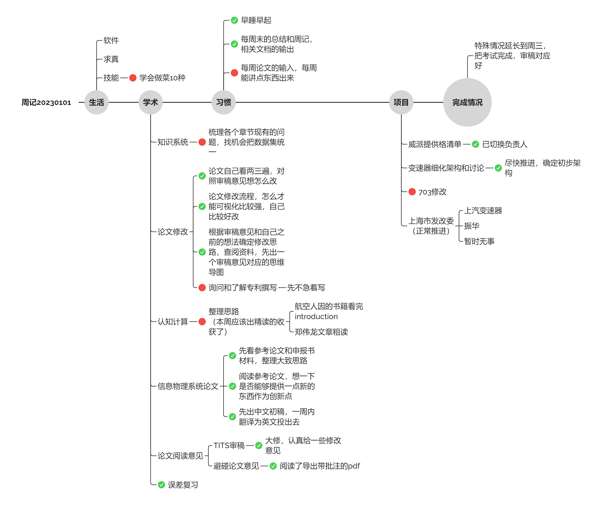

# 总结

## 计划总结

本周规划了大约10天，但是还是有很多事情没做完，原因是后面几天都有点摆烂，后面几天没心思学习

总结：每周的论文阅读和总结仍然没有完成，以及知识系统的代码还没开始写。

信息物理系统论文写了个大致的思路，但是距离预想还是差挺多的（预期是给一个初稿）

论文修改也没有完全按照规划完成，预期应该是全都知道怎么修改。

误差复习时间比预想更久

下周规划：这周规划内容太多，且有突发事件，后续应该找回状态，不谈弥补，至少按计划行事。

## 数据总结

### Vscode

这周没有编写代码。

### Zotero

这周其实看论文不少，但是基本都是粗读，没有仔细看过论文，这是一直以来的问题。所以才会想要每周精读一点论文，但是目前还没走上正轨，这周一定要坚持了。

另外这张图貌似看不出什么信息，下周换个报表。

### 整体软件报表

没想到这周微信登顶了，浏览器大部分时间应该在查资料，后面ppt，obsidian、zotero看起来还可以。但是总感觉有效学习时间应该不如上周。

## 习惯总结

- 早睡早起：这周睡得晚也起得晚，下周开始保证11点上床，七点半起床了。
- 周记总结：Done
- 论文精读：这周没有完成

其他习惯待定

