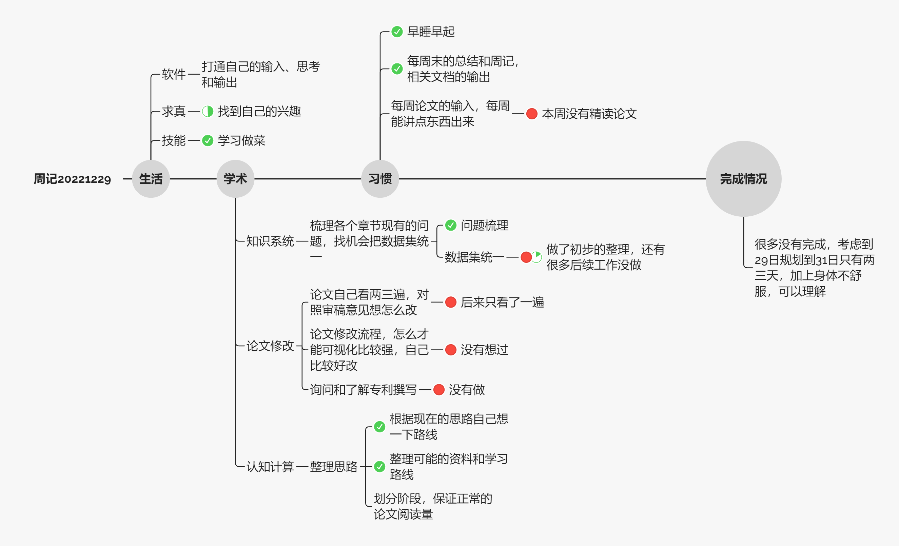

# 总结

## 计划总结

本周周记只规划了三天，具体做事情可能只有 29 日一天。30 日上午参加了智能运维交叉论坛，下午回去了，今天上午去了医院，下午写总结。

明天还有一天可以多看点论文，把项目上的一些事情做完。

## 数据总结

### Vscode

Vscode 软件使用报表，整体还可以，尽量达到 20 小时每周，日均 3h 差不多。

### Zotero

主要阅读时间在看自己论文和人因的书籍，时间都不多，这周总共才两三个小时，下周应该进入正轨。

### 整体软件报表

浏览器很大一部分是看 R 语言教程，整体尚可

## 习惯总结

- 早睡早起：Done，这周睡得早但起的稍晚
- 周记总结：Done
- 论文精读：这周没有完成

其他习惯待定

## 下周基础规划

- 这周的学术计划（知识系统、论文修改和论文精读）继续往前推。
- 多尝试点不同形式的娱乐，找到自己兴趣
- 学会做 10 种菜品

# 收获 

## 生活收获

这周最重要的进展是搭建了博客网站的框架，一定程度上也激励自己整理文字，做周记做总结

这周也回忆了家中书架上印象深刻的书籍，记录下来感觉挺有意义的。

看视频方面发现自己还是喜欢快节奏的视频（解说）和科普类视频，这周看影视飓风的视频比较多，画质好且内容有编排，观看体验还是可以的。

## 想法

腊八回家的时候发现家里的老人都老了很多